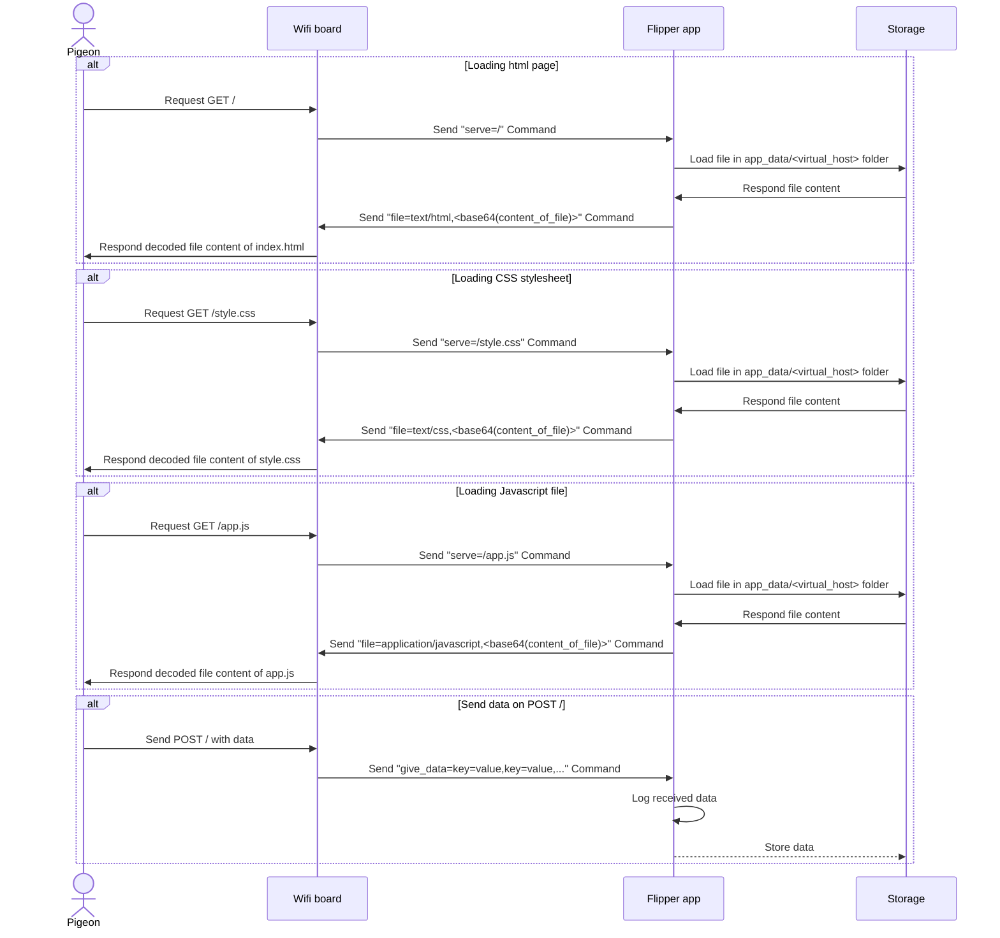

# Evil Portal V2

Evil Portal V2 is an evolution of the original Evil Portal app available on [RogueMaster](https://github.com/RogueMaster/flipperzero-firmware-wPlugins).

It is built in two separate parts:

1. The Flipper app `Evil Portal V2`
2. The WiFi Dev Board firmware `Evil Portal V2`

Those 2 parts communicate with each other through message queues through the GPIO serial port that can easily send / receive strings.

## Features

- Configuration files
- Multiple file serving
- Single hook method `POST` on `/`
  - Everything coming in a `POST` request body will be sent to the Flipper application in order to be logged
- Message queue communication between Flipper app and WiFi Dev Board

## Feature details

### Configuration files

Based on the behavior of an `Apache / Nginx VirtualHost`, it contains all the necessary configuration to create a working WebServer.

In the Flipper app, a menu entry `Load conf file` will parse the configuration file and send all the instructions to the
WiFi board to run the web server.

#### Syntax

The file syntax is a simple `key=value`.

It handles GET and POST requests, multiple routes with their corresponding file serving.

Here's an example of a full configuration file:

```conf
// Set Access Point name
ap_name=my nice access point;

// Define listening port
port=8042 // Default value is 80

// Define files that can be loaded with path, file type (like 'html' => 'text/html', 'css' => 'text/css', 'js' => 'application/javascript') and filename
serve=/,html,index.html      // Serve index.html on path /
serve=/style,css,style.css   // Serve style.css on path /style
serve=/app,js,app.js         // Serve app.js on path /app
```

> It is necessary to manually define all the path that will be used by your web page in order for the Flipper App to know how to serve each file.

Workflow of the loading of a page:



### Hook method on POST /

The web server on the WiFi Dev Board will always be configured the same way:

A single `POST /` route is designed to send all of the request body to the Flipper Application through the [give_data Command](#give-data) //TODO: define the give_data section

### Command Message Queue

The communication between Flipper App and WiFi Dev Board is handled in 2 different ways:

- Instructions from Flipper App to WiFi Dev Board to configure stuff
  - (Asynchronous) Like an UDP request: Flipper App only sends instructions to the Firmware but does not wait for a response
- WiFi Dev Board request -> Flipper App response
  - (Synchronous) Like a TCP request: Firmware asks for something and waits for a response

The way Flipper App => WiFi Dev board is made through an async MessageQueue

The way WiFi Dev Board => Flipper App is made through a sync communication

#### Protocol

Here's the definition of all the commands in both ways to communicate

##### Asynchronous protocol

There is the definition of the messages that the Flipper App sends to the WiFi Dev Board Firmware mostly to configure itself

###### set_ap

Command to setup the access point name (default value `Evil Portal V2`)

*Example*: `set_ap=Free Wifi Hotspot`

| Token               | Description          |
| ------              | -------------------- |
| `set_ap`            | Command              |
| `Free Wifi Hotspot` | Name of access point |

---

###### set_port

Command to setup the listening port (default value `80`)

*Example*: `set_port=80`

| Token               | Description          |
| ------              | -------------------- |
| `set_port`          | Command              |
| `80`                | Port to listen on    |

---

###### notify_start

Command to notify that the server is done and can run. The Firmware will not run the server while this command is not sent

*Example*: `notify_start`

---

##### Synchronous protocol

There is the definiton of the requests that the Firmware can send to the Flipper App in order to get file content to send to the client

###### serve

**Request**: `serve=<route_to_serve>`

*Example*: `serve=/`

| Token   | Description                             |
| ------- | --------------------------------------- |
| `serve` | Command                                 |
| `/`     | Path the Flipper App knows how to serve |

###### file

**Response**: `file=<base64(content_of_file)>`

*Example*: `file=text/html,PGh0bWw+PGJvZHk+PGgxPmNvdWNvdTwvaDE+PC9ib2R5PjwvaHRtbD4=`

| Token          | Description                  |
| -------------- | ---------------------------- |
| `file`         | Command                      |
| `text/html`    | File content type            |
| `PGh...RtbD4=` | Base 64 encoded file content |

---

###### give_data

> This call needs no response

**Request**: `give_data=username:em@i.l,pass:word,other:data,another:other_data`

*Example*: `give_data=u:igotfckd@gmail.com,p:mypaswd`

---